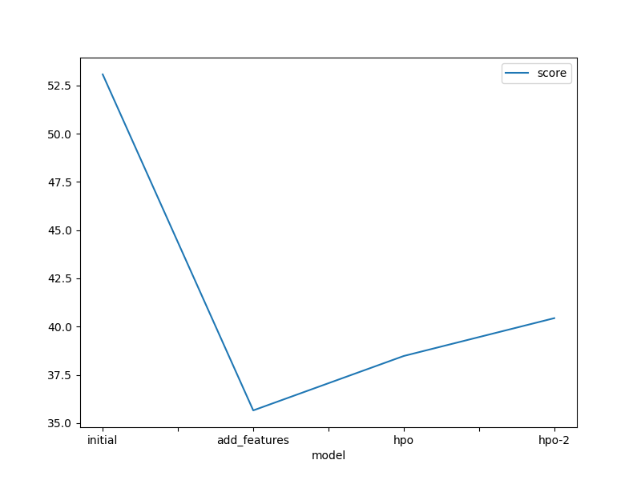
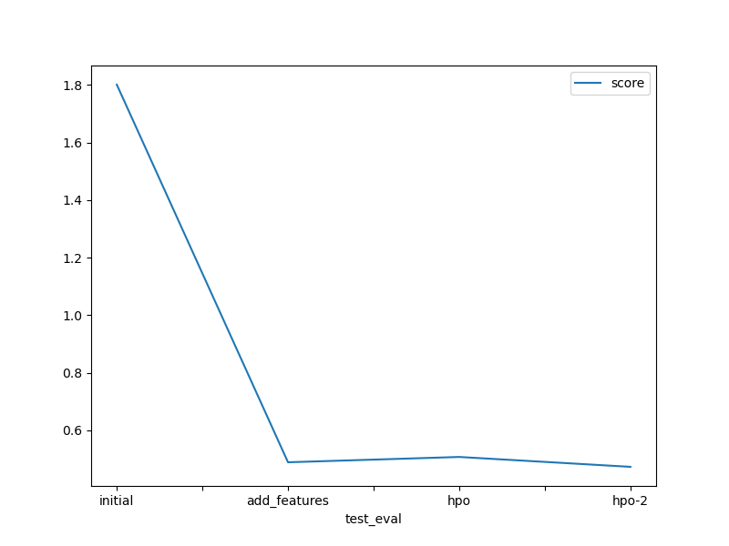

# Report: Predict Bike Sharing Demand with AutoGluon Solution
#### John Elomunait

## Initial Training
### What did you realize when you tried to submit your predictions? What changes were needed to the output of the predictor to submit your results?

Initially, when attempting to submit predictions, it became apparent that the model needed to output numerical values rather than categorical predictions. This required adjustments to the predictor to ensure it produced continuous values representing the demand for bike sharing.

### What was the top ranked model that performed?

The top-performing model in the initial training phase was the WeightedEnsemble_L3 model, achieving an RMSE of approximately 53.08.

## Exploratory data analysis and feature creation
### What did the exploratory analysis find and how did you add additional features?

During the exploratory analysis, I identified the datetime column as a valuable source for feature engineering. By extracting temporal components such as year, month, day, and hour from the datetime column, I created new features. These features were appropriately categorized to ensure the model recognized them as categorical variables. The addition of these features significantly enriched the feature space and provided the model with additional information to make more accurate predictions.

### How much better did your model perform after adding additional features and why do you think that is?

After incorporating the new features derived from datetime components, the model's performance improved significantly. The RMSE decreased from approximately 53.08 to 35.67, representing a substantial enhancement in prediction accuracy. I believe this improvement can be attributed to the increased richness of the feature space, allowing the model to capture more nuanced patterns and relationships in the data. Additionally, the categorical nature of the new features provided the model with additional contextual information, further improving its predictive capabilities.

## Hyper parameter tuning
### How much better did your model preform after trying different hyper parameters?
Hyperparameter tuning was conducted using AutoGluon in two runs:
- In the first run (hpo), 15 trials focused on gradient boosting machines (GBM) and categorical boosting (CAT) models. The best model achieved an RMSE score of 0.50725.
- In the second run (hpo-2), with reduced trials (5), additional models such as extreme gradient boosting (XT), random forest (RF), neural network (NN_TORCH), and k-nearest neighbors (KNN) were explored, leading to an improved RMSE score of 0.47294.

### If you were given more time with this dataset, where do you think you would spend more time?
Given more time, further exploration could be conducted in feature engineering to potentially uncover additional variables or transformations that could enhance model performance. Additionally, fine-tuning hyperparameters and experimenting with more advanced modeling techniques could lead to additional improvements.

### Hyperparameter table
| model        | hpo1            | hpo2                          | hpo3                                      |   score |
|:-------------|:----------------|:------------------------------|:------------------------------------------|--------:|
| initial      | prescribed vals | prescribed vals               | presets: 'high_quality (auto_stack=True)' | 1.80123 |
| add_features | prescribed vals | prescribed vals               | preset: 'high_quality (auto_stack=True)'  | 0.4888  |
| hpo          | n_trials: 15    | (GBM, CAT)                    | preset: 'high_quality', time_limit:900    | 0.50725 |
| hpo-2        | n_trials: 5     | (CAT, XT, RF, NN_TORCH & KNN) | preset: 'high_quality', time_limit:900    | 0.47294 |

### Create a line plot showing the top model score for the three (or more) training runs during the project.

### Create a line plot showing the top kaggle score for the three (or more) prediction submissions during the project.

## Summary

In summary, the iterative approach of feature engineering and hyperparameter tuning using AutoGluon has led to significant improvements in the predictive performance of the bike-sharing demand prediction model. By enhancing the feature space with new datetime-derived features and optimizing model hyperparameters, we were able to substantially reduce the prediction error, as evidenced by the decreased RMSE scores on both the training and test datasets. This iterative refinement process underscores the importance of systematic experimentation and optimization in building robust predictive models.